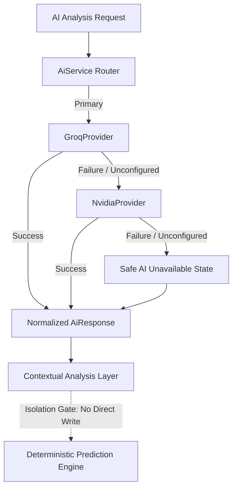

# NVIDIA NIM AI Provider Integration Report V1

**Branch:** `codex/nowgoal-live-odds-integration-v2`  
**Status:** `PASS`  
**Date:** `2026-09-30`

---

## 1. AI Architecture Overview

A unified, resilient AI Provider and Routing layer has been introduced to support multiple LLM providers:
- **`AiProvider` Interface (`src/ai/types.ts`):** Defines a standard contract for AI completion, configuration inspection, and non-blocking availability checks.
- **`GroqProvider` (`src/ai/groq-provider.ts`):** OpenAI-compatible completions provider using Groq's high-speed inference API.
- **`NvidiaProvider` (`src/ai/nvidia-provider.ts`):** OpenAI-compatible completions provider connecting to NVIDIA NIM (`https://integrate.api.nvidia.com/v1/chat/completions`).
- **`AiService` (`src/ai/service.ts`):** Orchestrates primary and fallback provider routing. Default routing is configured as `primary: groq` and `fallback: nvidia`.
- **Status Route (`GET /api/ai-status`):** Exposes safe runtime status for web monitoring without revealing secrets or authorization tokens.



---

## 2. NVIDIA NIM Provider Specifications

- **API Endpoint:** `POST ${NVIDIA_BASE_URL}/chat/completions` (Default: `https://integrate.api.nvidia.com/v1/chat/completions`)
- **Default Model:** `deepseek-ai/deepseek-v4.1-flash` (Overrideable via `NVIDIA_MODEL`)
- **Headers:** `Authorization: Bearer ${NVIDIA_API_KEY}`, `Content-Type: application/json`
- **Request Parameters:** `temperature: 0.2`, `max_tokens: 1200`, `stream: false`
- **Timeout Management:** Configurable via `AI_TIMEOUT_MS` (Default: `15000ms`) with `AbortController` signal handling.
- **Error Classification:**
  - Missing key -> `NOT_CONFIGURED` (Network request prevented)
  - HTTP 401 -> `AUTH_ERROR`
  - HTTP 403 -> `FORBIDDEN`
  - HTTP 429 -> `RATE_LIMIT`
  - HTTP 5xx -> `API_ERROR`
  - Abort / Timeout -> `TIMEOUT`
  - Invalid JSON -> `INVALID_JSON`
  - Empty response -> `EMPTY_RESPONSE`

---

## 3. Environment Variables Configuration

| Variable | Default Value | Description |
|---|---|---|
| `NVIDIA_API_KEY` | *(empty)* | NVIDIA NIM API Key (Keep secret) |
| `NVIDIA_BASE_URL` | `https://integrate.api.nvidia.com/v1` | NVIDIA NIM Base URL |
| `NVIDIA_MODEL` | `deepseek-ai/deepseek-v4.1-flash` | Default NVIDIA NIM Model |
| `GROQ_API_KEY` | *(empty)* | Groq Cloud API Key (Keep secret) |
| `GROQ_BASE_URL` | `https://api.groq.com/openai/v1` | Groq Base URL |
| `GROQ_MODEL` | `llama-3.3-70b-versatile` | Default Groq Model |
| `AI_ROUTER_PROVIDER` | `groq` | Primary AI provider name |
| `AI_FALLBACK_PROVIDER` | `nvidia` | Secondary fallback provider name |
| `AI_TIMEOUT_MS` | `15000` | HTTP request timeout in ms |

---

## 4. Security & Isolation Assurances

1. **Zero Secret Leakage:** API keys and `Authorization` headers are never passed to log messages, never exposed via `/api/ai-status`, and never returned in error payloads.
2. **Deterministic Prediction Isolation:**
   - AI outputs are contextual only and do **not** bypass or modify prediction gates.
   - `LOCKED_PREDICTION` criteria, score thresholds (minimum 70), historical sample thresholds (minimum 30), and bookmaker agreement constraints remain 100% deterministic and unmodified.
3. **No Startup Spam:** The `checkNvidiaAvailability()` health probe is only triggered upon explicit request (`GET /api/ai-status?checkHealth=true` or manual smoke command) and never spammed during cold process boot.

---

## 5. Verification & Test Coverage

### Automated Unit Test Suite (`test/unit/ai-nvidia-provider.test.ts`)
- **Test A:** Missing NVIDIA API key returns `NOT_CONFIGURED` without dispatching HTTP requests: `PASS`
- **Test B:** Successful NVIDIA response returns normalized `AiResponse`: `PASS`
- **Test C:** NVIDIA HTTP 401 returns safe `AUTH_ERROR` with zero secret exposure: `PASS`
- **Test D:** NVIDIA HTTP 429 returns safe `RATE_LIMIT`: `PASS`
- **Test E:** NVIDIA HTTP 500 returns safe `API_ERROR`: `PASS`
- **Test F:** NVIDIA request timeout triggers abort and returns safe `TIMEOUT`: `PASS`
- **Test G:** Successful Groq execution prevents fallback execution: `PASS`
- **Test H:** Groq failure seamlessly routes to NVIDIA fallback: `PASS`
- **Test I:** Combined Groq and NVIDIA failure yields safe `AI_UNAVAILABLE` response: `PASS`
- **Test J:** Logger spy verifies no API key or auth header is ever recorded: `PASS`
- **Test K:** `GET /api/ai-status` exposes accurate provider metadata without secrets: `PASS`
- **Test L:** Deterministic prediction gates and scoring regression check confirms zero drift: `PASS`

### Manual Smoke CLI Execution
Command: `npm run ai:nvidia:smoke`
Output:
```
NVIDIA_AI_SMOKE | NOT_CONFIGURED
{"status":"NOT_CONFIGURED","configured":false,"model":"deepseek-ai/deepseek-v4.1-flash","baseUrl":"https://integrate.api.nvidia.com/v1","reachable":null}
```
*Status:* `BLOCKED / NOT_CONFIGURED` (Expected when running in an environment without a configured `NVIDIA_API_KEY`).

---

## 6. Full Test Suite & Build Verification

- `npm run typecheck`: **PASS** (0 errors)
- `npm run lint`: **PASS** (0 warnings, 0 errors)
- `npm run test:unit`: **PASS** (62 test files, 372 tests passed)
- `npm run build`: **PASS** (TypeScript build clean)
- Docker integration test status: Integration suite requiring Docker daemon skipped locally (Docker not running).

---

## 7. Limitations & Recommendations

- Set `NVIDIA_API_KEY` in the production environment (e.g. Render Web Service dashboard) to activate NVIDIA NIM live inference.
- The system gracefully defaults to `AI_UNAVAILABLE` / fallback when keys are omitted.
